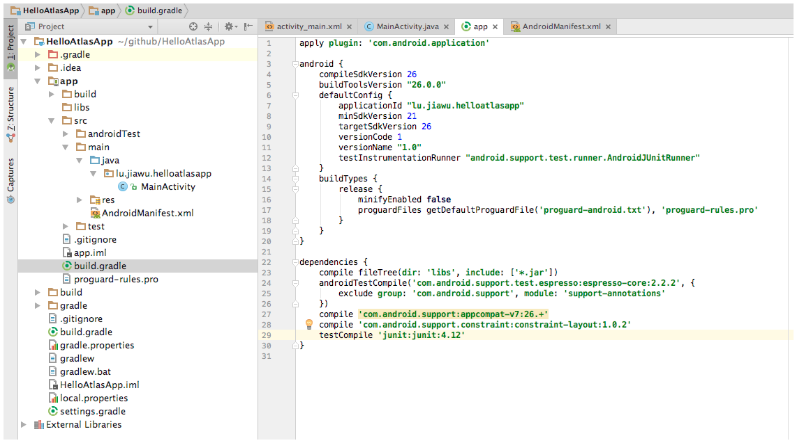
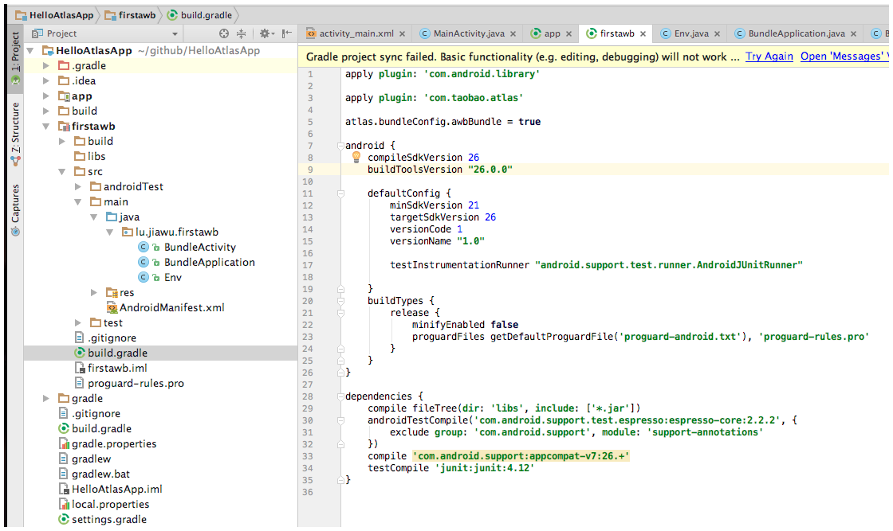
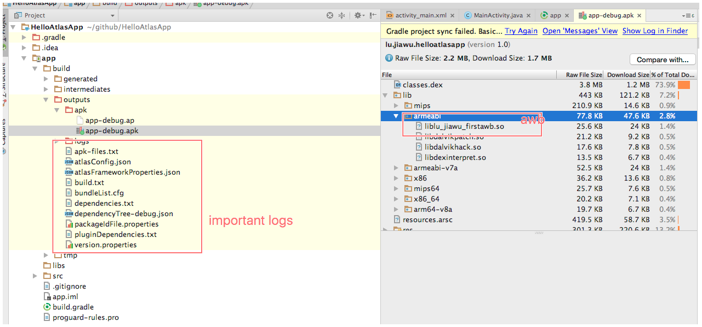

# create your first Atlas app

This page teaches you how to build and run a very simple atlas app using Android Studio. The app that you create has a simple structure similar to the structure described in Structure of a basic atlas app.

	Note: You should use Android Studio version 2.3 to complete the procedures on this page. Also make sure that you have completed the setup instructions in Set up your development environment. 

To create a new atlas app project in Android Studio version 2.3, do the following:

### 1. Launch Android Studio and create a new standard android application project

just as you see, it's a standard android application.

### 2. Add AtlasPlugin to the App

1. add atlasplugin to replace google's default android builder. edit the build.gradle file at the root of the project:

		buildscript {
		    repositories {
		        jcenter()
		    }
		    dependencies {
				 //classpath 'com.android.tools.build:gradle:2.3.0'
		        classpath "com.taobao.android:atlasplugin:2.3.3.rc20"
		
		        // NOTE: Do not place your application dependencies here; they belong
		        // in the individual module build.gradle files
		    }
		}
		

2. apply atlasplugin for your app. edit the build.gradle at the app dir:

		apply plugin: 'com.android.application'
		apply plugin: 'com.taobao.atlas'
		
3. config atlasplugin , here is the simplest one.

		atlas {
		    atlasEnabled true
		}		

4. add atlas runtime sdk to your dependencies

		dependencies {
		   	//your other dependencies here
		    compile 'com.taobao.android:atlas_core:5.0.7.41@aar'
		}

and that's all, your app is based on atlas now. now we continue to add some awb 

### 3. Create Awb

if you don't know awb,you can find the answer in the introduce document

1. 	Use Android studio to add a new Module to your Project
2. Select Android Library and click Next
3. Enter the module's name, for example 'firstawb'
4. 	After a while your standard android library is ready
5. refacotr it to be an Awb module from Aar. add the below two lines after the `apply plugin: 'com.android.library'` , that's All
		
		apply plugin: 'com.taobao.atlas'
		atlas.bundleConfig.awbBundle = true
		
6. write your biz code here,  eg:

		
		
### 4. Add the Awb to your App	

as awb is very like aar , so the usage is very similar to the standrard project module or gav .

	dependencies {
	    
	    compile 'com.taobao.android:atlas_core:5.0.7.41@aar'
	
	    bundleCompile project(':firstawb')
	}

please attention here we use `bundleCompile` to replace the compile , so we can see very clearly which is awb.

### 5. Link your App and Awb

just use the Intent and startActivity api is enough, for more details you can found in the examples, eg:

	findViewById(R.id.btn_start_bundle).setOnClickListener(new View.OnClickListener() {
            @Override
            public void onClick(View v) {
                Log.d(Env.TAG, "onClick: ");
                startActivity(
                        new Intent().setClassName(getBaseContext(), "com.taobao.atlas.bundle.BundleActivity")
                );
            }
        });
        
### 6. Package your Atlas Application

you can either use the ide's run button, or type `./gradlew clean assembleDebug` 

the below is some of the important logs you must know:

1. dependencyTree-debug/release.json : it's the total dependency graph of your app , it has 2 level structer
2. atlasConfig.json : the atlasplugin's runtime parameters, you can config the different value in your build.gradle
3. atlasFrameworkProperties : atlas's core bundle info, it is very important at runtime

## Atlas plugin config

 function  | The name of the configuration |  type | value 
 ------------- | ------------- | ------------- | ------------- 
Enable atlas , true/false  | atlas.atlasEnabled | boolean  | true
bundlePackageId defines files that are not defined automatically  | atlas.tBuildConfig.packageIdFile | File  | 
Remote bundle list, artifactId  | atlas.tBuildConfig.outOfApkBundles | Set  | []
The value is packageName which auto start   | atlas.tBuildConfig.autoStartBundles | List  | 
Automatically generate the bundle's packageId  | atlas.tBuildConfig.autoPackageId | boolean  | true
Automatic allocation of packageId The minimum value  | atlas.tBuildConfig.minPackageId | int  | 35
If atlas is turned on, it must be true  | atlas.tBuildConfig.useCustomAapt | Boolean  | true
You need to do a databinding bundle, A value of packageName   | atlas.tBuildConfig.dataBindingBundles | Set  | []
Build the baseline package, and the suggestion is open, otherwise the patch package will not be able to proceed  | atlas.tBuildConfig.createAP | Boolean  | true
Whether to rely on conflict to terminate packaging  | atlas.tBuildConfig.abortIfDependencyConflict | boolean  | false
Whether class conflicts terminate packaging  | atlas.tBuildConfig.abortIfClassConflict | boolean  | false
Such as: com.taobao.android:taobao-android-release:6.3.0-SNAPSHOT@ap   | atlas.buildTypes.debug.baseApDependency | String  | 
Such as: com.taobao.android:taobao-android-release:6.3.0-SNAPSHOT@ap   | atlas.buildTypes.release.baseApDependency | String  | 
Keep a list of launch launches  | atlas.manifestOptions.retainLaunches | Set  | []
Reserved permissions list  | atlas.manifestOptions.retainPermissions | Set  | []
The name of the system permissions removed  | atlas.manifestOptions.removeSystemPermissions | Set  | []
The name of the removed custom permission  | atlas.manifestOptions.removeCustomPermission | boolean  | false
The ability to open new components  | atlas.manifestOptions.addAtlasProxyComponents | boolean  | false
A channel list that does not perform atlas added components  | atlas.manifestOptions.atlasProxySkipChannels | Set  | [:dex2oat, :dexmerge]
Use the atlas application, including atlasBasic initialization and multidex logic, Atlas must be opened  | atlas.manifestOptions.replaceApplication | boolean  | true
 Dynamic deployment patch package   | atlas.patchConfigs.debug.createTPatch | boolean  | false
Dynamic deployment does not contain a list of files  | atlas.patchConfigs.debug.tPatchNotIncludeFiles | Set  | []
 Dynamic deployment patch package   | atlas.patchConfigs.release.createTPatch | boolean  | false
Dynamic deployment does not contain a list of files  | atlas.patchConfigs.release.tPatchNotIncludeFiles | Set  | []

