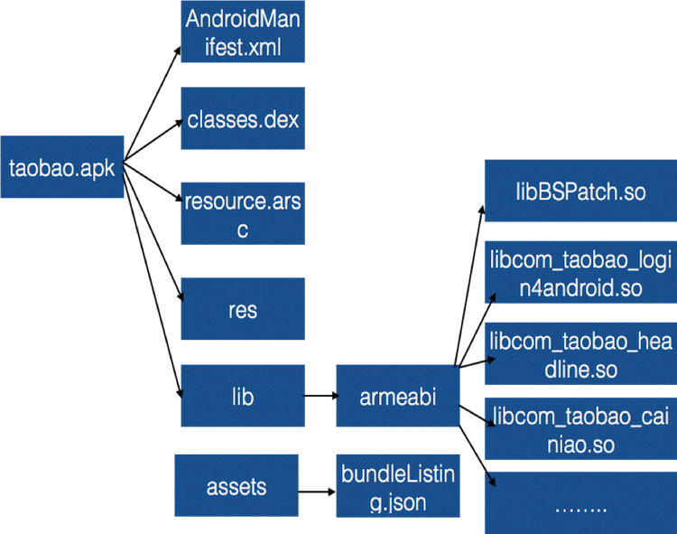
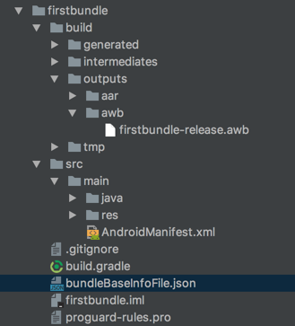

# Project structure
This page describes the various modules contained within an atlas app project. You should already understand concepts like aar, bundle, feature awb, and maindex. For a review of these concepts, see the Overview.

##Structure of a basic Atlas app

**figure 1 ** shows a basic apk build from atlas project,apk structure as follow:

    1.we put all bundle files in lib/armeabi directory ,android system help us to release them in app lib directory.

    2.such as libcom_....so,this is a bundle like a single apk ,contains dex,resources,and androidmanifest.

**figure 2 ** shows main project how to build a atlas apk File like figure 1:

1.apply plugins:

    apply plugin: 'com.android.application'
    apply plugin: 'com.taobao.atlas'
    or
    apply plugin: 'com.taobao.atlas.application'

2.dependencies in one project:

    bundleCompile project(':firstbundle')
    bundleCompile project(':secondbundle')
    bundleCompile project(':remotebundle')
    bundleCompile project(':publicbundle')
    bundleCompile project(':databindbundle')
    or
download dependencies from server

    bundleCompile 'com.taobao.android:publicbundle:1.0.0@awb'

3.define only on application name and packageName in androidManifest:

    <manifest xmlns:android="http://schemas.android.com/apk/res/android"
        package="com.taobao.demo">

        <uses-permission android:name="android.permission.INTERNET" />
        <uses-permission android:name="android.permission.ACCESS_NETWORK_STATE" />

        <application
            android:name=".DemoApplication"
            android:allowBackup="true"
            android:icon="@mipmap/ic_launcher"
            android:label="Atlas"
            android:supportsRtl="true">

applicationName is not essential,android.taobao.atlas.startup.AtlasBridgeApplication will be generated dynamic for the startup application when build for atlas apk.

**figure 3 ** bundle project build.gradle defination like this:
1.
    apply plugin: 'com.android.library'
    apply plugin: 'com.taobao.atlas'

    define atlas Extension:

    atlas {
        bundleConfig {
            awbBundle true
        }

    }

    ./gradlew assembleDebug can build awb package.

2.bundle project you can define your own application and your own pacakgeName, application oncreate method will be excuted when this bundle is using by Customers

atlas framework can dynamic install this bundle at the same time。

    <manifest xmlns:android="http://schemas.android.com/apk/res/android"
        package="com.taobao.firstbundle">

        <application
            android:name=".FirstbundleApplication"
            android:allowBackup="true"
            android:supportsRtl="true">
            <activity
                android:name=".FirstBundleActivity"
                android:theme="@style/AppTheme.NoActionBar" />

            <service
                android:name=".FirstBundleService"
                android:enabled="true"
                android:exported="true" />

            <activity android:name=".WebViewDemoActivity"
                android:theme="@style/AppTheme.NoActionBar"></activity>
        </application>

    </manifest>

3.when you want to import class from other bundles,you should define bundle dependencies in bundleBaseInfoFile.json ,when use this bundle in runtime,atlas framwork check dependency bundle first while dependency class load from dependency bundle,This would create a bad performce impression.

so it is not suggest way for interactive from diffrent bundles, aidi is recommended,bundleBaseInfoFile.json format:

    {
      "name": "第一个bundle",
      "dependency": ["com.taobao.publicBundle"]
    }

4.run ./gradlew assembleR ,firstBundle-release.awb is what we want.

